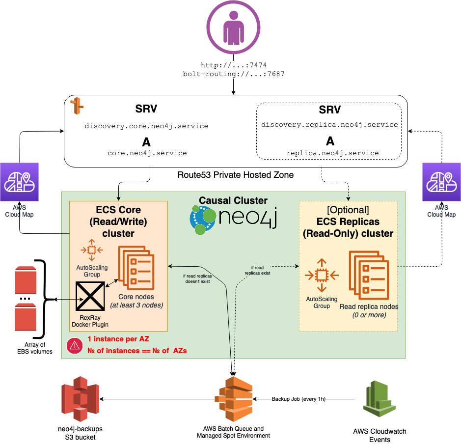

# Neo4j Causal Cluster setup for AWS by [GetSocial](https://getsocial.im)

A setup for a [Neo4j Enterprise](https://neo4j.com/subscriptions/#editions) [Causal Cluster](https://neo4j.com/docs/operations-manual/current/clustering/) on top of [AWS ECS](https://aws.amazon.com/ecs/).

You can obtain Neo4j from the [official website](https://neo4j.com/). Please contact sales@neo4j.com for Enterprise licensing.

1. [Why](#why)
1. [Features](#features)
1. [Includes](#includes)
1. [Limitations](#limitations)
1. [Prerequisites](#prerequisites)
1. [About](#about)
    1. [Core Servers](#Main-ECS-Cluster-of-Core-servers)
    1. [Read Replicas](#Optional-ECS-Cluster-of-Read-Replicas)
    1. [Discovery endpoints](#Discovery-endpoints)
    1. [Spot Setup](#Spot-setup)
1. [Usage](#Usage)
1. [Upgrade version](#upgrade-version)
    1. [Patch version upgrades](#patch-version-upgrades)
    1. [Major and minor version upgrades](#major-and-minor-version-upgrades)
1. [Neo4j cluster operations manual](#Neo4j-cluster-operations-manual)

## Why

Here at [GetSocial](https://getsocial.im) we started using Neo4j a few years ago to enhance our product with the power of social connections and we have been trying to find the architecture that can keep up with our growing service.

We run our infrastructure on AWS and the first approach to host Neo4j was using the suggested (at that time) HA Cluster architecture [neo4j-aws-ha-cluster](https://github.com/getsocial-rnd/neo4j-aws-ha-cluster), which lately [become deprecated](https://neo4j.com/developer/kb/comparing-ha-vs-causal-clusters/)
and that the new Causal Cluster architecture would be the preferred approach given its scaling possibilities and resilience to failing nodes.

## Features

- Automatic daily backups to S3 using a spot based AWS Batch Jobs
- Bootstrap a cluster from a backup snapshot.
- Cluster self-healing with AutoScaling group and data volumes reuse.
- CloudWatch alerts setup.
- Logging to CloudWatch Logs (general log by default and slow query log can be optionally enabled).
- Automatically create users+credentials for read-only and read/write access.
- DNS based discovery without ELB (because [Causal Cluster has built-in load balancing and routing via Bolt Driver](https://medium.com/neo4j/querying-neo4j-clusters-7d6fde75b5b4)).
- Automated and safe rolling operational procedures like upgrade, upscale, downscale, restart (powered by [ecs-drain-lambda](https://github.com/getsocial-rnd/ecs-drain-lambda) as external dependency, see [additional information](#ECS-Instances-draining-support)).

  ***WARNING* Rolling upgrades have [limitations](https://neo4j.com/docs/operations-manual/current/upgrade/causal-cluster/#cc-upgrade-rolling)**
- Spot setup for reduced costs (but with additional risks).

## Includes

- Customizable CloudFormation template.
- Extended docker image on top [official Neo4j image](https://hub.docker.com/_/neo4j/). Current version - *Neo4j 3.5.18*:
  - Custom extension [ecs-extension.sh](./ecs-extension.sh) for official [docker-entrypoint.sh](https://github.com/neo4j/docker-neo4j/blob/master/docker-image-src/3.5/docker-entrypoint.sh)
  - Custom healthcheck script [healthcheck.sh](./healthcheck.sh)
  - Custom script for initial db users creation [init-db.sh](./init-db.sh)

## Limitations

- #### **1 core server per AWS Availability Zone**

    This setup using [RexRay Docker Plugin](https://github.com/rexray/rexray) to reuse/remount EBS data volumes upon container restarts, instances replacement, etc.
    However, this creates a major limitation, you can have only 1 instance per AZ and you should
    have an equal amount of instances to the amount of configured Availability Zones.

    For Example:

    - A setup where **№ of instances** bigger than **№ of Availability Zones** will not work
    - A setup where **№ of instances** smaller than **№ of Availability Zones** will generate operational issues

    **Most of AWS regions has 3 AZs in place, so you can have only 3 CORE servers**. Except `us-east-1` which has 6 or `ca-central-1` and `us-west-1` which has 2 (as of September 2019).

- #### Backups related limitations

    - You can't restore a cluster from a backup without a downtime. Rolling backup restore is not possible. You need to stop the cluster and then do the imports. See [further instructions](https://neo4j.com/docs/operations-manual/current/backup/restoring/#backup-restoring-causal-cluster)
    - Restore from the specific backup file on the same cluster possible only once. Successful restore from backup [will create *file-marker* on the data volume](./ecs-extension.sh#120-125) to avoid the backup re-import on every docker container restart.
    - During backup restore from the backup follower nodes may get restarted once, after they start next time cluster should successfully form itself.

- #### ECS Instances draining support

    - Most of the ECS/ASG related operations are based on the [feature of draining ECS instances](https://docs.aws.amazon.com/AmazonECS/latest/developerguide/container-instance-draining.html), however automatic draining is not a native feature and requires external lambda function to be deployed in your AWS Region. Recommended tool to use is [ecs-drain-lambda](https://github.com/getsocial-rnd/ecs-drain-lambda).

- Autoscaling Groups doesn't scale cluster automatically but used to keep cluster at desired capacity and replace unhealthy nodes.

- Neo4j instances **must** have internet access (so your Subnets must have NAT Gateway or Internet Gateway attached (and **Auto-assign public IPv4 address** should be enabled)

## Prerequisites

- Install [Docker](https://docs.docker.com/engine/installation/) to build the image.
- [AWS CLI](https://aws.amazon.com/cli) for the ECR Auth.

## About



Neo4j graph database is deployed as a Causal Cluster ([HA clustering is deprecated in the latest neo4j versions](https://neo4j.com/developer/kb/comparing-ha-vs-causal-clusters/)).
It uses [Bolt](https://boltprotocol.org/) – a highly efficient, lightweight binary client-server protocol designed for database applications.

Essentially it's a Neo4j cluster with a minimum of 3 nodes
(for successful startup and leader election, the cluster will still function with 2 healthy nodes in runtime,
this is used for rolling operations, nodes will be removed/restarted one by one while other two keep functioning).

Setup is split logically into 2 ECS clusters (yet still it's 1 Neo4j cluster):

- ### Main ECS Cluster of Core servers

  - Should have 3 or more nodes
  - Electing cluster leader which accepts writes
  - Persists data on external EBS volumes (see related [limitations](#1-core-server-per-AZ))

  *IMPORTANT: please read [official documentation](https://neo4j.com/docs/operations-manual/current/clustering/introduction/#causal-clustering-core-servers) about Core Servers*

- ### Optional ECS Cluster of Read Replicas

  - Does not persist data on EBS volumes, upon each restart/replacement pull data from the Core servers
  - Can be horizontally scaled endlessly - as many nodes as needed
  - Does not participate in the leader election
  - Can not become the leader
  - Can not accept write queries
  - Read queries will be automatically routed to the Read replicas if [`bolt+routing://`](https://neo4j.com/developer/kb/how-neo4j-browser-bolt-routing/) is used
  - Backups are performed on these nodes to avoid performance hits on Core Servers
  - Can be deployed as a different EC2 instance type (for temporary heavy analytics, etc)
  - Can handle complex queries without affecting the performance of the R/W cluster.

  *IMPORTANT: please read [official documentation](https://neo4j.com/docs/operations-manual/current/clustering/introduction/#causal-clustering-read-replicas) about Read Replicas*

- ### Discovery endpoints

    Discovery endpoints powered by AWS Cloud Map integration with ECS.
    AWS Cloud Map automatically generates [SRV](https://en.wikipedia.org/wiki/SRV_record) DNS records in the Route53 Private hosted zone for healthy ECS Tasks (taking into account docker healthchecks).
    However, discovery via SRV will require some additional code in your application to be able to connect to the Neo4j servers,
    as well you can not open it in your browser. For convenience this CloudFormation template includes small [Lambda function](./cloudformation.yml#1380) which generates the [Multivalue
    A](https://docs.aws.amazon.com/Route53/latest/DeveloperGuide/routing-policy.html#routing-policy-multivalue) records based on automatically generated SRV ones.

    You can use the A records in production, however, since they are replicated from the SRV records (which are the source of truth) it may take a bit longer to propagate.

    Example                         | Type |  Description
    --------------------------------|------|----------------
    discovery.core.neo4j.service    | SRV  | Autogenerated discovery SRV record for Core nodes in format `discovery.<core_prefix>.<cloudmap_service_name>`
    core.neo4j.service              | Multivalue A | Replicated via lambda A record for Core nodes in format `<core_prefix>.<cloudmap_service_name>`
    discovery.replica.neo4j.service | SRV  | Autogenerated discovery SRV record for Read replicas in format `discovery.<replica_prefix>.<cloudmap_service_name>`
    replica.neo4j.service           | Multivalue A | Replicated via lambda A record for Read replicas in format `<replica_prefix>.<cloudmap_service_name>`

    **NOTE:** Read Replica endpoints created only if Read Replica is enabled for the deployment.

    **WARNING:** CloudFormation stack removal may fail due to the still existing A records created by lambda, in this case, you need to remove them manually from AWS CloudMap console and try CloudFormation stack removal once again.

    **WARNING:** Since AWS CloudMap creates **Private Hosted zone** you will not be able to reach it from your laptop or other VPC.
    To be able to reach the private records you may need to have a VPN connection to your VPC or some other ways.

- ### Spot setup

    This CloudFormation template allows you, optionally, to deploy your cluster on the [EC2 Spot Instances](https://docs.aws.amazon.com/AWSEC2/latest/UserGuide/using-spot-instances.html).
    Deploying a cluster on the Spot instances allows you to save a lot of money on the EC2 instances, however, produces additional risks.
    These risks are mitigated by using mixed instance types in different Availability Zones, this is minimizing the chance that more than one Neo4j instance will be
    interrupted at the same time and Neo4j cluster of 3 nodes is tolerant to the interruption of one node.

    If you are unwilling to take the risk, it is possible to use Spot Instances only for Read replicas, interruption of which doesn't result in any risks.

    Usage of spot instances is configured via CloudFormation template parameters `ClusterInstanceType` and `ReplicasInstanceType`. To enable spot setup
    pick from the drop-down one of the "custom" instance types with `spot` prefix (underlying instance types under the "custom" ones, can be found in the 
    [CloudFormation template mappings](./cloudformation.yml#173))

## Usage

1. Create an ECR repository for Neo4j custom images. You will use its ARN.
   (ARN looks like `arn:aws:ecr:us-east-1:123456789012:repository/neo`).

2. Save environment variable for use in the makefile (customize them first)

    ```sh
    export NEO_ECR_REPO=<paste here ARN of your ECR repo>
    export NEO_AWS_REGION=<your AWS region>
    ```

3. Build a Docker image and push it to your ECR:

    ```sh
    make push_image
    ```

4. If you know what are you doing feel free to modify `cloudformation.yml` in any way you like before spinning up infrastructure,
however, most of the things are customizable via parameters.

5. [Create a Cloud Formation stack](https://console.aws.amazon.com/cloudformation/home#/stacks/new) using `cloudformation.yml` with your parameters.

    _If you don't need the Read Replicas you can set the `ReplicasCount=0` and ignore the rest of `Slave` related parameters (except `SlaveSubnetID` you need to choose any subnet there)_

    **Parameters reference**

    ----

    ***Neo4j License***

    Parameter | Description
    ----------|------------
    AcceptLicense | Before using Neo4j, you **must** accept [license](https://neo4j.com/licensing/)

    ----

    ***Global configurations***

    Parameter | Description
    ----------|------------
    VpcId     | Existing AWS VPC to deploy the Neo4j cluster in
    KeyName   | SSH key to use for cluster EC2 instances access
    ECSAMI    | ECS Optimized AMI Version [as SSM AMI metadata parameter path](https://docs.aws.amazon.com/AmazonECS/latest/developerguide/retrieve-ecs-optimized_AMI.html)<br>By default use the **recommended** one, however keeping this setting as is during further stack updates may result in unexpected AMI update (when new AMI version will become the **recommended** one)<br>If you don't want to update AMI, pin AMI version to specific value with value like `/aws/service/ecs/optimized-ami/amazon-linux-2/amzn2-ami-ecs-hvm-2.0.20181112-x86_64-ebs`
    NodeSecurityGroups | List of additional Security Groups to assign to the EC2 instances (for example, your custom SG group for SSH access or VPN access, etc)
    SNSTopicArn | SNS topic to send CloudWatch Alerts to, you could provide an ARN of the existing topic or new topic will be created if you don't specify any

    ----

    ***Core Nodes Configuration***

    Parameter | Description
    ----------|------------
    ClusterInstanceType | AWS Instance type to use for Neo4j Cluster Core nodes (possible to use spot instances, [see details](#spot-setup))
    SubnetID | List of subnets to deploy your cluster into.<br>**Must include at least 3 subnets in different AZ** [see details](#1-core-server-per-AZ)
    DesiredCapacity | Number of desired Neo4j Core nodes. <br>**Must be at least 3 nodes and must much the number of subnets in different AZs** [see details](#1-core-server-per-AZ)
    EBSSize | Size of EBS volume for Neo4j data in GBs
    EBSType | Type of EBS volume

    ----

    ***Read replicas configuration***

    Parameter | Description
    ----------|------------
    ReplicasInstanceType | AWS Instance type to use for Neo4j Cluster Read Replicas (possible to use spot instances, [see details](#spot-setup))
    ReplicasCount | Number of the desired Neo4j Read replicas. Set to `0` if you don't want to deploy read replicas (all the other resources associated with Read replicas will be not created as well. In this case all other the replica related parameters can be ignored)
    ReplicasSubnetID | List of subnets to deploy your read replicas into.

    ----

    ***Docker image configurations***

    Parameter | Description
    ----------|------------
    DockerImage | URL of your custom build Neo4j image (in the following format `111111111111.dkr.ecr.us-east-1.amazonaws.com/neo:c531de3a6655b8c885330ca91b867431760392bf`)
    DockerECRARN | ARN of your Private ECR repo (in the following format `arn:aws:ecr:us-east-1:111111111111:repository/neo`)

    ----

    ***Neo4j users configuration***

    Parameter | Description
    ----------|------------
    AdminUser | Must be `neo4j`
    AdminPassword | Password for the `neo4j` user
    ReadOnlyUser | Name for the Neo4j Read-Only user
    ReadOnlyUserPassword | Password for the Neo4j Read-Only user

    ----

    ***Cloud Map discovery settings***

    Parameter | Description
    ----------|------------
    CloudMapNamespaceID | ID of an existing CloudMap Namespace to use for discovery. If not set, a new CloudMap Namespace will be created for you automatically
    CloudMapNamespaceName | Name of the CloudMap Namespace. If CloudMapNamespaceID is set to use an existing Namespace then CloudMapNamespaceName should be match the existing Namespace name. If CloudMapNamespaceID is not set, then a new CloudMap Namespace will be created automatically with the provided name.<br>See [more details](#Discovery-endpoints)
    Neo4jCoreSubdomain | The subdomain that will be used for the Neo4j Core Cluster. Will look like `<subdomain>.<namespace>`. For example: `core.neo4j.service`. By default is set to `core`
    Neo4jReplicasSubdomain | The subdomain that will be used for the Neo4j Read replicas. Will look like `<subdomain>.<namespace>`. For example: `replica.neo4j.service`, by default is set to `replica`

    ----

    ***Neo4j operations***

    Parameter | Description
    ----------|------------
    BackupPath | Full S3 path (in format `<bucket_name>/path/to/backup.zip`). ***This parameter is used ONLY when you want to start/restore Neo4j cluster from backup***.<br>See related [limitations](#Backups-related-limitations)
    BackupHourlyStoreForDays | Number of days to keep hourly backups
    BackupDailyStoreForDays | Number of days to keep daily backups (hourly backup made on midnight considered as daily backup)
    IsDrainSupported | If set to `true`, instances replacement will be done automatically in rolling way with the usage of ASG Termination Hooks. Set this parameter to `true` only after deploying [ecs-drain-lambda](https://github.com/getsocial-rnd/ecs-drain-lambda), [see additional information](#ECS-Instances-draining-support). If this parameter set to `false` Rolling Update of AutoScaling Group  will not be triggered automatically, because that will result in downtime and you will need to do the operations manually (not recommended)
    SlowQueryLog | Enable logging of Cypher queries that takes longer than 500 ms to the CloudWatch log. If enabled additional tiny sidecar container will be deployed next to Neo4j containers to tail the `slow_query.log` and push it to the CloudWatch log (additional CloudWatch log group will be created as well)

## Upgrade version

### Patch version upgrades

Upgrade between patch versions can be done using [rolling upgrades](https://neo4j.com/docs/operations-manual/current/upgrade/causal-cluster/#cc-upgrade-rolling).
However, it is possible only when a *store format upgrade* is not needed (see release notes for a particular change).

### Major and minor version upgrades

Major and minor version upgrades not tested yet and probably may require [offline upgrade](https://neo4j.com/docs/operations-manual/current/upgrade/causal-cluster/#cc-upgrade-offline).

## Neo4j cluster operations manual

Most of cluster operations is done via ECS Console:

- #### Stop cluster

    1. Go to [ECS Console](https://console.aws.amazon.com/ecs/home?#/clusters)
    1. Find your Neo4j cluster, try searching by `Neo4jCluster` (for Core nodes cluster) or `Neo4jReplicas` (for Read replicas cluster)
    1. Open the Neo4j service (the only one)
    1. Click **Update**
    1. Set **Number of tasks** to `0`
    1. Click **Skip to review** and **Update Service**
    1. Wait until all Neo4j containers are stopped on the Service **Deployments** page (you will see **Running count: 0**)

- #### Start cluster

    1. Go to [ECS Console](https://console.aws.amazon.com/ecs/home?#/clusters)
    1. Find your Neo4j cluster, try searching by `Neo4jCluster` (for Core nodes cluster) or `Neo4jReplicas` (for Read replicas cluster)
    1. Open the Neo4j service (the only one)
    1. Click **Update**
    1. Set **Number of tasks** to the number of nodes in your cluster (if it is Core cluster, the number is usually `3`)
    1. Click **Skip to review** and **Update Service**
    1. Wait until all Neo4j containers are started on the Service **Deployments** page (you will see **Running count: 3**)

- #### Restart cluster

    1. Go to [ECS Console](https://console.aws.amazon.com/ecs/home?#/clusters)
    1. Find your Neo4j cluster, try searching by `Neo4jCluster` (for Core nodes cluster) or `Neo4jReplicas` (for Read replicas cluster)
    1. Open the Neo4j service (the only one)
    1. Click **Update**
    1. Check **Force new deployment**
    1. Click **Skip to review* and *Update Service**
    1. Wait until all Neo4j containers are restarted in a rolling way on the Service **Deployments** page (you will see **Running count** of the old and new deployments)

- #### Reset cluster data

    Sometimes you may need to wipe all the data from the cluster (for testing purpose or, for example, you want to import data from the backup).
    The fastest way to do this is following:

    1. [Stop cluster](#stop-cluster)
    1. Go to [AWS EC2 Volumes Console](https://console.aws.amazon.com/ec2/v2/home?#Volumes:)
    1. Search for the volumes with `State: Available` and `tag:Name: <cloudformation-stack-name-data>`
    1. This should probably result in 3 volumes
    1. Remove this volumes *(DO THIS ON YOUR OWN RISK)*
    1. [Start cluster](#start-cluster)

## TODO

- Allow to customize backup frequency
- Automatically create CloudWatch dashboard with main cluster metrics
- Automatically scale Read Replicas?!
- Allow defining static On-Demand capacity for Spot setup
- Make stack simpler to deploy:
    - Publish custom neo4j image on DockerHub
    - Add LauchStack button
- More advanced monitoring ([Halin](https://medium.com/neo4j/monitoring-neo4j-with-halin-4c11429b46ff) or sending runtime metrics to CloudWatch)
